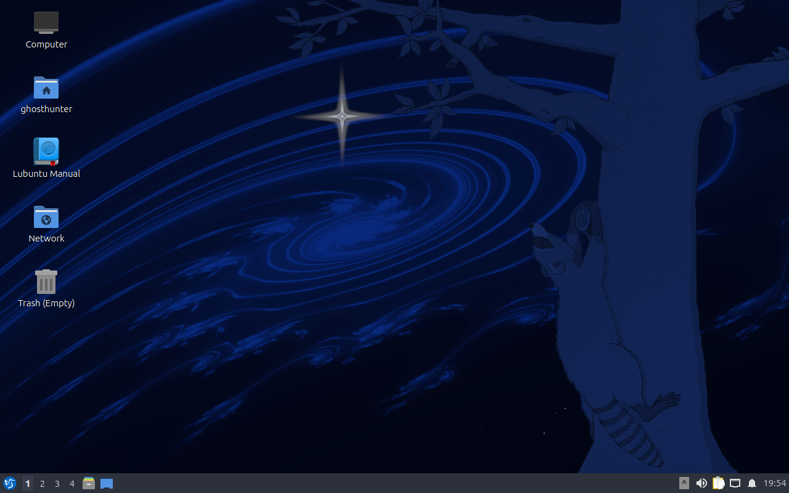
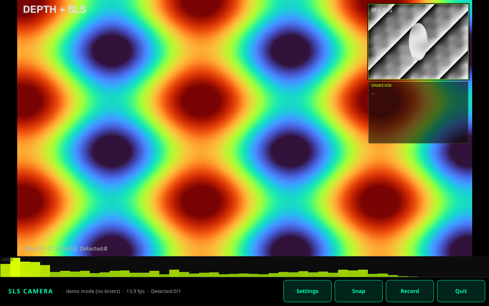

# First boot (appliance)

## Lab VM credentials (rebuild standard)

| User | Password | Purpose |
|------|----------|---------|
| **`sls`** | **`20260717`** | Appliance autologin, SSH, field app session (**use this**) |

Lab-only — change on real tablets. Full rebuild procedure: **[VM-REBUILD.md](VM-REBUILD.md)**.

## Phase 1 (install-appliance.sh)

After install on a blank Ubuntu/Lubuntu system:

1. Reboot  
2. Auto-login as user **`sls`** (SDDM on Lubuntu 26.04; also LightDM/GDM when present)  
3. Session autostart: **landscape lock** + DPMS off, then **`/usr/local/bin/sls-camera`** as `sls`  
4. SLS app opens fullscreen (expect width ≥ height; native portrait panels are rotated)  

If a temporary ISO install user still exists (e.g. leftover desktop scrap), remove it and keep only **`sls`** — see [VM-REBUILD.md](VM-REBUILD.md).

Without a Kinect (VM smoke test), run:

```bash
/usr/local/bin/sls-camera --demo
```

### Quit / power off (respects app request)

The launcher **`/usr/local/bin/sls-camera`** prefers the **app’s exit code** (product contract for [sls-camera#4](https://github.com/tmdrake/sls-camera/issues/4)):

| Exit code | Meaning | Launcher action |
|-----------|---------|-----------------|
| **0** | Clean quit | `SLS_QUIT_FALLBACK` (appliance default **`none`** — stay up) |
| **10** | Operator requested **host power-off** | Power off |
| **11** | Relaunch app | Restart launcher |
| other | Error / crash | Exit (no power off); optional `SLS_QUIT_ON_ERROR=restart` |

| Env | Values | Role |
|-----|--------|------|
| `SLS_QUIT_ACTION` | `shutdown` (appliance default), `exit` | Forces app Power-off-on-Quit mode (sls-camera#4) |
| `SLS_ON_QUIT` | `app` (default), `shutdown`, `restart`, `none` | How launcher reacts to exit codes |
| `SLS_QUIT_FALLBACK` | `none` (default), `shutdown`, `restart` | Only if app still exits **0** on Quit |

App pin: see `packages/app-ref.txt` (includes exit 10 + `SLS_CAPTURES_DIR`).  
Firmware handoff: app repo `software/linux/docs/FOR-FIRMWARE-TEAM.md`.

Lab VM credentials: **`sls` / `20260717`** — see [VM-REBUILD.md](VM-REBUILD.md).

Launcher debug log (guest): `/data/sls-captures/launcher.log` (or `/tmp/sls-camera-launcher.log`).

### Login screen once instead of autologin

SDDM can drop to the greeter if the session **crashes** or is torn down mid-boot. With **`Relogin=true`**, the next attempt should autologin again as `sls`. Check:

```bash
journalctl -u sddm -b
# look for: sddm-helper crashed / Authentication error
```

### Screenshots (Phase 1 VM — Lubuntu 26.04)

Full-size PNGs live in [`docs/images/`](images/README.md).

| | |
|--|--|
| Desktop after install |  |
| SLS Camera `--demo` |  |

Operator should only need:

- Kinect **power brick** + USB  
- (Optional) audio: `kinect-audio-setup` once if spectrum/record mic required  

## Captures

- Preferred: `/data/sls-captures`  
- Launcher exports `SLS_CAPTURES_DIR` when that directory exists  

## Failure modes

| Symptom | Check |
|---------|--------|
| Black screen / no app | `journalctl -b`, autostart desktop file, `DISPLAY` |
| freenect BUSY | `lsmod \| grep gspca`; blacklist applied? |
| Spectrum says **default** / not Kinect mic | Offline pack should include `kinect-audio-setup` deb + `vendor/kinect/UACFirmware` from fetch; unplug/replug Kinect. Rebuild stick if missing. |
| **Blank screen** on some boots | Launcher waits for X + re-applies landscape; autostart delays 3s. If still blank: SSH, check `launcher.log`, restart `/usr/local/bin/sls-camera`. See [POWER-AND-DISPLAY.md](POWER-AND-DISPLAY.md). |
| Spectrum silent | `libportaudio2`, Kinect USB Audio after firmware |

## Factory reset (Phase 3)

Re-run `install-appliance.sh` or reflash ISO; wipe `/data` only if operator confirms investigation media can be discarded.
